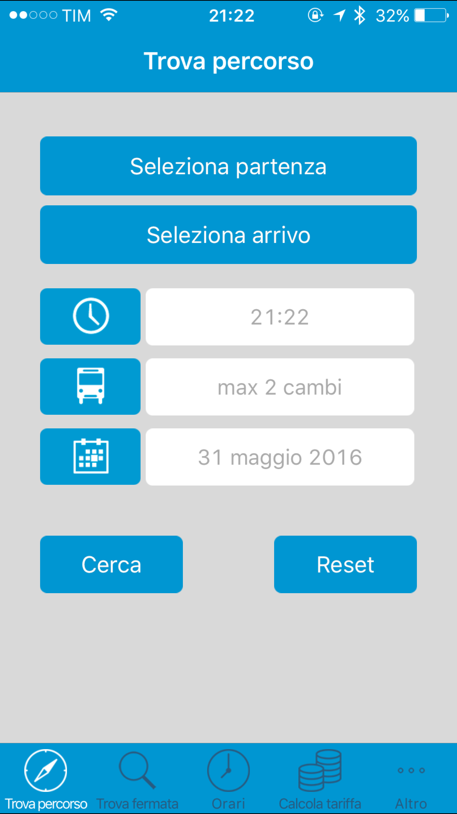
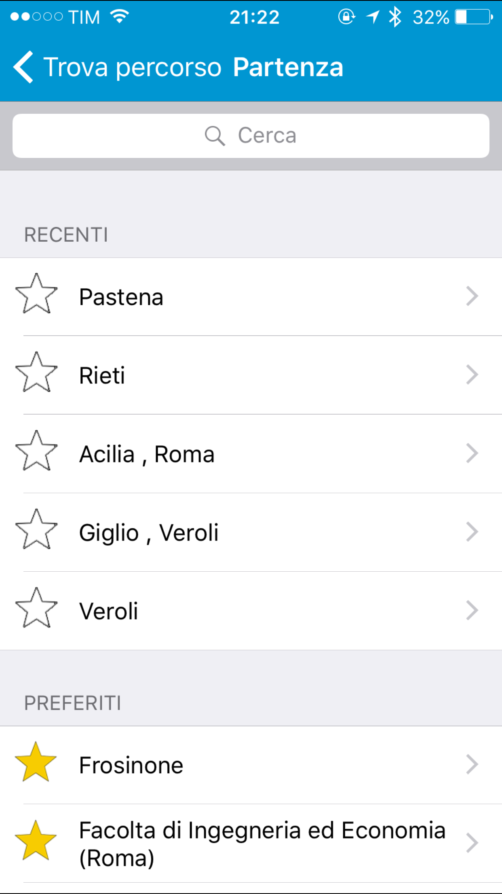
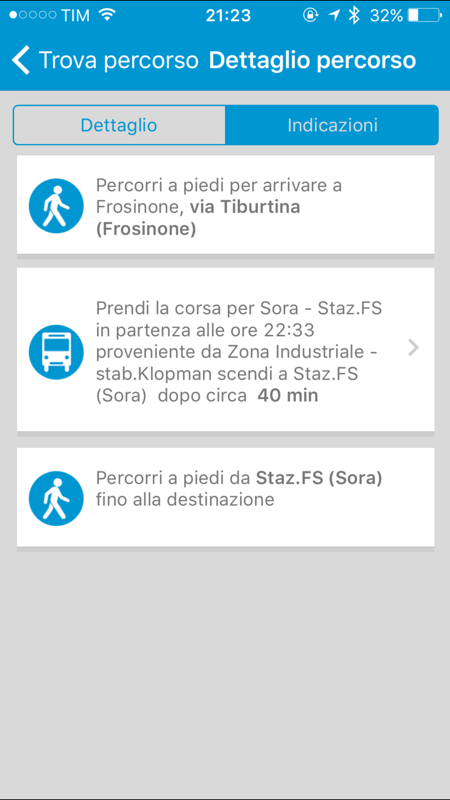
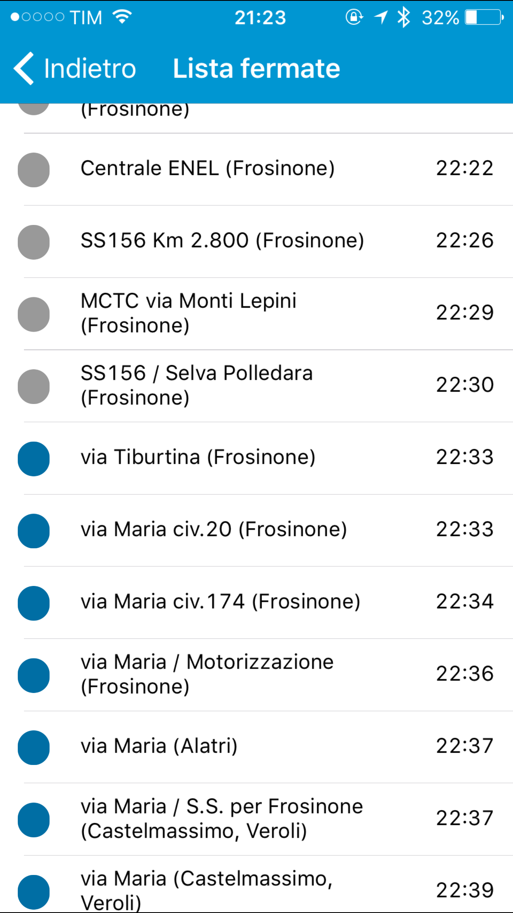

LazioBus-iOS
====================

**Project closed on 05/08/2016**

The project was developed by a group of students enrolled at the faculty of Computer Engineering at the University of Rome Tor Vergata. The need was to always have all the information you need to plan a trip using public transport. 

The application has been developed for all mobile platforms, iOS, Android and Windos Phone. 
This repository contains only the code written by me for the iOS application.

Below are some screenshots:

## Screenshot

